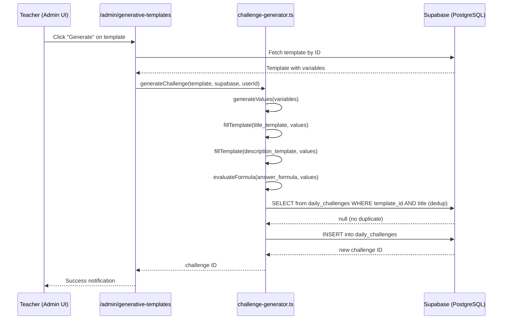
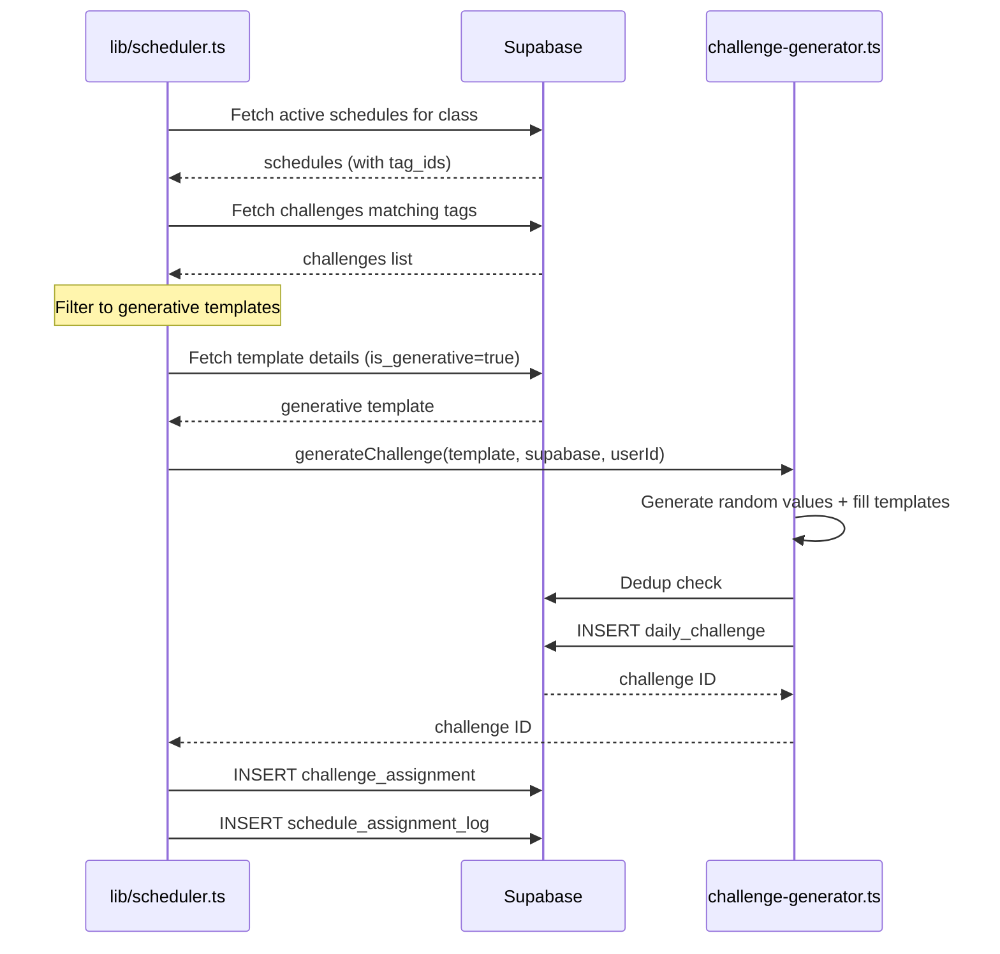
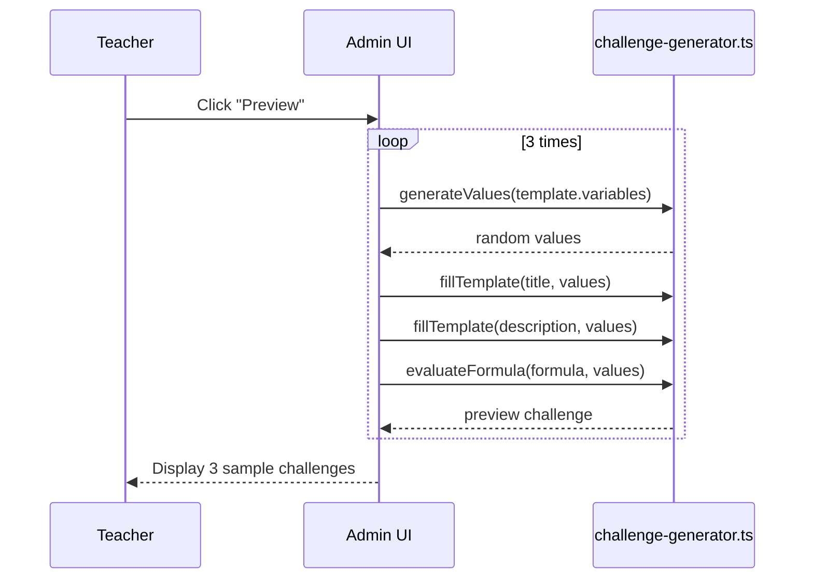

# Design Document: Generative Challenge Templates

## Overview

Generative Challenge Templates allow teachers to create parameterized challenge patterns that produce randomized math problems. Each template defines a title pattern, description pattern, variables with randomization rules, and an answer formula. When a challenge is generated from a template, the system fills in random values, computes the expected answer, and creates a unique daily challenge — enabling teachers to produce unlimited practice problems from a single template definition.

This feature extends the existing `challenge_templates` table with generative fields rather than creating a new table, and integrates with the existing scheduler to auto-generate challenges on schedule. A deduplication mechanism ensures the same exact challenge (same template + same title) is never created twice.

The admin UI at `/admin/generative-templates` provides a create/edit form, list view, live preview, and manual generation controls. Future Phase 2 will add ChatGPT integration for natural language template creation.

## Architecture

```mermaid
graph TD
    subgraph Admin UI
        A[/admin/generative-templates] --> B[Create/Edit Form]
        A --> C[Template List View]
        A --> D[Preview Panel]
        A --> E[Generate Button]
    end

    subgraph Core Logic
        F[lib/challenge-generator.ts] --> G[generateValues]
        F --> H[fillTemplate]
        F --> I[evaluateFormula]
        F --> J[generateChallenge]
    end

    subgraph Database
        K[(challenge_templates)] --> L[is_generative fields]
        M[(daily_challenges)] --> N[template_id + expected_answer]
    end

    subgraph Integration
        O[lib/scheduler.ts] --> F
        P[app/challenges/new] --> F
    end

    B --> F
    E --> F
    J --> K
    J --> M
    O --> K
```

## Sequence Diagrams

### Manual Challenge Generation



### Scheduler Auto-Generation



### Template Preview Flow



## Components and Interfaces

### Component 1: Challenge Generator (`lib/challenge-generator.ts`)

**Purpose**: Core logic for generating randomized challenges from templates.

**Interface**:
```typescript
interface Variable {
  type: 'random_int' | 'random_choice' | 'random_float'
  min?: number
  max?: number
  options?: string[]
  decimals?: number
}

interface GenerativeTemplate {
  id: string
  title_template: string
  description_template: string
  variables: Record<string, Variable>
  answer_formula: string
  max_points: number
  tag_ids: string[]
}

interface GeneratedChallenge {
  title: string
  description: string
  expected_answer: string
  values: Record<string, number | string>
}

// Public API
function generateValues(variables: Record<string, Variable>): Record<string, number | string>
function fillTemplate(template: string, values: Record<string, number | string>): string
function evaluateFormula(formula: string, values: Record<string, number | string>): string
function previewChallenge(template: GenerativeTemplate): GeneratedChallenge
async function generateChallenge(
  template: GenerativeTemplate,
  supabase: SupabaseClient,
  userId: string
): Promise<string | null>
```

**Responsibilities**:
- Generate random values based on variable definitions
- Fill template strings with generated values
- Safely evaluate mathematical formulas
- Check for duplicate challenges before insertion
- Create new daily challenges in the database

### Component 2: Admin UI (`app/admin/generative-templates/page.tsx`)

**Purpose**: Teacher-facing interface for creating, managing, and generating challenges from templates.

**Interface**:
```typescript
interface TemplateFormState {
  titleTemplate: string
  descriptionTemplate: string
  variables: Record<string, Variable>
  answerFormula: string
  maxPoints: number
  tagIds: string[]
}

interface TemplateListItem {
  id: string
  title_template: string
  variables: Record<string, Variable>
  created_at: string
  challenge_count: number  // how many challenges generated from it
}
```

**Responsibilities**:
- Render create/edit form with variable builder
- Display list of existing generative templates
- Provide live preview of generated challenges
- Trigger manual challenge generation
- Validate template syntax (matching `{{variables}}`)

### Component 3: Scheduler Integration (`lib/scheduler.ts`)

**Purpose**: Extend existing scheduler to handle generative templates.

**Responsibilities**:
- Detect when a scheduled template is generative (`is_generative = true`)
- Call `generateChallenge()` instead of directly assigning existing challenges
- Handle dedup failures gracefully (retry with new random values)

## Data Models

### Extended `challenge_templates` Table

```typescript
interface ChallengeTemplate {
  id: string                          // UUID, existing
  created_by: string                  // UUID, existing
  title: string                       // existing
  description: string                 // existing
  // --- New generative fields ---
  is_generative: boolean              // default false
  title_template: string | null       // "九九乘法: {{a}} × {{b}}"
  description_template: string | null // "計算 {{a}} × {{b}} = ?"
  variables: Record<string, Variable> | null  // JSONB
  answer_formula: string | null       // "{{a}} * {{b}}"
  max_points: number                  // default 10
  tag_ids: string[]                   // UUID array
  created_at: string
  updated_at: string
}
```

**Validation Rules**:
- If `is_generative = true`, then `title_template`, `description_template`, `variables`, and `answer_formula` must be non-null
- All `{{variable}}` references in templates must have corresponding entries in `variables` JSONB
- `variables` must have at least one entry
- For `random_int`: `min` < `max`, both integers
- For `random_float`: `min` < `max`, `decimals` between 0 and 10
- For `random_choice`: `options` must have at least 2 items
- `max_points` must be positive integer

### Extended `daily_challenges` Table

```typescript
interface DailyChallenge {
  id: string
  created_by: string
  title: string
  description: string
  challenge_date: string
  max_points: number
  tag_ids: string[]
  image_url: string | null
  // --- New fields ---
  template_id: string | null          // FK to challenge_templates
  expected_answer: string | null      // computed answer for auto-grading
  created_at: string
  updated_at: string
}
```

**Validation Rules**:
- `template_id` is nullable (challenges can exist without templates)
- `expected_answer` is nullable (only set for generated challenges)
- Unique constraint on `(template_id, title)` WHERE `template_id IS NOT NULL` — prevents duplicate generated challenges

</text>
</invoke>

## Key Functions with Formal Specifications

### Function 1: `generateValues()`

```typescript
function generateValues(variables: Record<string, Variable>): Record<string, number | string>
```

**Preconditions:**
- `variables` is a non-empty object
- Each variable entry has a valid `type` field ('random_int' | 'random_choice' | 'random_float')
- For `random_int`: `min` and `max` are defined integers, `min <= max`
- For `random_float`: `min` and `max` are defined numbers, `min <= max`, `decimals` is defined
- For `random_choice`: `options` is a non-empty array of strings

**Postconditions:**
- Returns an object with the same keys as `variables`
- For `random_int` entries: value is an integer where `min <= value <= max`
- For `random_float` entries: value is a number with exactly `decimals` decimal places, `min <= value <= max`
- For `random_choice` entries: value is one of the items in `options`
- No side effects

**Loop Invariants:**
- All previously generated values remain unchanged as subsequent variables are processed

### Function 2: `fillTemplate()`

```typescript
function fillTemplate(template: string, values: Record<string, number | string>): string
```

**Preconditions:**
- `template` is a non-empty string
- `values` contains entries for all `{{variable}}` placeholders in the template

**Postconditions:**
- Returns a string with all `{{variable}}` patterns replaced by their corresponding values
- If a variable reference has no matching key in `values`, it is replaced with the key name itself
- Original template string is not mutated
- No `{{...}}` patterns remain in the output (all are resolved)

**Loop Invariants:** N/A (single regex replace operation)

### Function 3: `evaluateFormula()`

```typescript
function evaluateFormula(formula: string, values: Record<string, number | string>): string
```

**Preconditions:**
- `formula` is a non-empty string containing mathematical expression with `{{variable}}` placeholders
- `values` contains numeric entries for all variables referenced in the formula
- The filled formula produces a valid JavaScript arithmetic expression (only `+`, `-`, `*`, `/`, `%`, `(`, `)`, digits, decimals)

**Postconditions:**
- Returns the string representation of the evaluated mathematical result
- If evaluation fails (invalid expression), returns empty string `''`
- No side effects, no access to global scope during evaluation
- Result is deterministic given the same inputs

**Loop Invariants:** N/A

### Function 4: `generateChallenge()`

```typescript
async function generateChallenge(
  template: GenerativeTemplate,
  supabase: SupabaseClient,
  userId: string
): Promise<string | null>
```

**Preconditions:**
- `template` is a valid GenerativeTemplate with all required fields
- `supabase` is an authenticated Supabase client
- `userId` is a valid UUID of a user with `challenge:create` permission

**Postconditions:**
- If a challenge with the same `template_id` and `title` already exists, returns the existing challenge ID (no new row created)
- If no duplicate exists, creates a new `daily_challenges` row and returns its ID
- The created challenge has: correct `title`, `description`, `expected_answer`, `template_id`, `max_points`, `tag_ids`, and today's date
- Returns `null` only if the database insert fails

**Loop Invariants:** N/A

## Algorithmic Pseudocode

### Challenge Generation Algorithm

```typescript
/**
 * ALGORITHM: generateChallenge
 * INPUT: template (GenerativeTemplate), supabase (SupabaseClient), userId (string)
 * OUTPUT: challengeId (string | null)
 * 
 * PRECONDITION: template is valid, supabase is authenticated, userId has create permission
 * POSTCONDITION: Either returns existing duplicate ID or newly created challenge ID
 */
async function generateChallenge(
  template: GenerativeTemplate,
  supabase: SupabaseClient,
  userId: string
): Promise<string | null> {
  // Step 1: Generate random values for all template variables
  const values = generateValues(template.variables)
  // ASSERT: values has same keys as template.variables
  // ASSERT: each value satisfies its variable type constraints

  // Step 2: Fill title and description templates
  const title = fillTemplate(template.title_template, values)
  const description = fillTemplate(template.description_template, values)
  // ASSERT: title contains no {{...}} patterns
  // ASSERT: description contains no {{...}} patterns

  // Step 3: Compute expected answer
  const expectedAnswer = evaluateFormula(template.answer_formula, values)
  // ASSERT: expectedAnswer is a string (possibly empty on error)

  // Step 4: Deduplication check
  const { data: existing } = await supabase
    .from('daily_challenges')
    .select('id')
    .eq('template_id', template.id)
    .eq('title', title)
    .maybeSingle()

  if (existing) {
    return existing.id  // Already exists, return existing
  }

  // Step 5: Insert new challenge
  const { data: challenge, error } = await supabase
    .from('daily_challenges')
    .insert({
      title,
      description,
      template_id: template.id,
      expected_answer: expectedAnswer,
      max_points: template.max_points,
      tag_ids: template.tag_ids,
      challenge_date: new Date().toISOString().split('T')[0],
      created_by: userId
    })
    .select('id')
    .single()

  // ASSERT: if no error, challenge.id is a valid UUID
  return error ? null : challenge.id
}
```

### Value Generation Algorithm

```typescript
/**
 * ALGORITHM: generateValues
 * INPUT: variables (Record<string, Variable>)
 * OUTPUT: values (Record<string, number | string>)
 * 
 * PRECONDITION: variables is non-empty, each entry has valid type constraints
 * POSTCONDITION: values has same keys, each value satisfies type constraints
 * LOOP INVARIANT: All previously generated values remain valid
 */
function generateValues(variables: Record<string, Variable>): Record<string, number | string> {
  const values: Record<string, number | string> = {}

  for (const [name, def] of Object.entries(variables)) {
    // INVARIANT: all values[k] for k processed before name are valid

    switch (def.type) {
      case 'random_int': {
        // Generate integer in [min, max] inclusive
        const range = def.max! - def.min! + 1
        values[name] = Math.floor(Math.random() * range) + def.min!
        // ASSERT: def.min <= values[name] <= def.max
        break
      }
      case 'random_float': {
        // Generate float in [min, max] with specified decimal places
        const raw = Math.random() * (def.max! - def.min!) + def.min!
        values[name] = parseFloat(raw.toFixed(def.decimals || 1))
        // ASSERT: def.min <= values[name] <= def.max
        break
      }
      case 'random_choice': {
        // Pick random element from options array
        const index = Math.floor(Math.random() * def.options!.length)
        values[name] = def.options![index]
        // ASSERT: values[name] is in def.options
        break
      }
    }
  }

  return values
}
```

### Safe Formula Evaluation Algorithm

```typescript
/**
 * ALGORITHM: evaluateFormula
 * INPUT: formula (string), values (Record<string, number | string>)
 * OUTPUT: result (string)
 * 
 * PRECONDITION: formula contains {{variable}} placeholders, values has numeric entries
 * POSTCONDITION: result is string representation of evaluated expression, or '' on error
 * SECURITY: Only allows arithmetic operators, no access to global scope
 */
function evaluateFormula(formula: string, values: Record<string, number | string>): string {
  // Step 1: Replace all {{variable}} with their values
  const filled = fillTemplate(formula, values)

  // Step 2: Validate the expression contains only safe characters
  // Allow: digits, decimal points, arithmetic operators, parentheses, whitespace
  const safePattern = /^[\d\s+\-*/%().]+$/
  if (!safePattern.test(filled)) {
    return ''  // Reject unsafe expressions
  }

  // Step 3: Evaluate using Function constructor (sandboxed)
  try {
    const result = Function('"use strict"; return (' + filled + ')')()
    return String(result)
  } catch {
    return ''
  }
}
```

### Scheduler Integration Algorithm

```typescript
/**
 * ALGORITHM: assignOneChallengeWithGenerative
 * INPUT: supabase, schedule, classId, today
 * OUTPUT: void (side effect: creates assignment)
 * 
 * PRECONDITION: schedule is active, today needs assignment
 * POSTCONDITION: One challenge is assigned to the class (either existing or newly generated)
 */
async function assignOneChallengeWithGenerative(
  supabase: SupabaseClient,
  schedule: Schedule,
  classId: string,
  today: string
): Promise<void> {
  const tagIds: string[] = schedule.tag_ids || []
  if (tagIds.length === 0) return

  // Check if any generative templates match the schedule's tags
  const { data: templates } = await supabase
    .from('challenge_templates')
    .select('*')
    .eq('is_generative', true)
    .overlaps('tag_ids', tagIds)

  if (templates && templates.length > 0) {
    // Pick a random generative template
    const template = templates[Math.floor(Math.random() * templates.length)]
    
    // Generate a new challenge from the template
    const challengeId = await generateChallenge(template, supabase, schedule.created_by)
    
    if (challengeId) {
      // Assign to class
      await supabase
        .from('challenge_assignments')
        .insert({
          challenge_id: challengeId,
          class_id: classId,
          assigned_by: schedule.created_by
        })

      // Log it
      await supabase
        .from('schedule_assignment_log')
        .insert({
          schedule_id: schedule.id,
          challenge_id: challengeId,
          assigned_date: today
        })
      return
    }
  }

  // Fallback: use existing non-generative assignment logic
  await assignOneChallenge(supabase, schedule, classId, today)
}
```

## Example Usage

```typescript
// Example 1: Create a multiplication template
const multiplicationTemplate: GenerativeTemplate = {
  id: 'template-uuid-1',
  title_template: '九九乘法: {{a}} × {{b}}',
  description_template: '計算 {{a}} × {{b}} = ?',
  variables: {
    a: { type: 'random_int', min: 1, max: 9 },
    b: { type: 'random_int', min: 1, max: 9 }
  },
  answer_formula: '{{a}} * {{b}}',
  max_points: 10,
  tag_ids: ['math-basics-tag-id']
}

// Example 2: Preview a challenge (no DB interaction)
const preview = previewChallenge(multiplicationTemplate)
// preview = {
//   title: "九九乘法: 3 × 7",
//   description: "計算 3 × 7 = ?",
//   expected_answer: "21",
//   values: { a: 3, b: 7 }
// }

// Example 3: Generate and persist a challenge
const challengeId = await generateChallenge(multiplicationTemplate, supabase, userId)
// challengeId = "new-challenge-uuid" or existing ID if duplicate

// Example 4: Random choice variable
const wordProblemTemplate: GenerativeTemplate = {
  id: 'template-uuid-2',
  title_template: '{{fruit}} Problem',
  description_template: 'You have {{a}} {{fruit}}s. You give away {{b}}. How many remain?',
  variables: {
    a: { type: 'random_int', min: 5, max: 20 },
    b: { type: 'random_int', min: 1, max: 4 },
    fruit: { type: 'random_choice', options: ['apple', 'banana', 'orange'] }
  },
  answer_formula: '{{a}} - {{b}}',
  max_points: 10,
  tag_ids: ['subtraction-tag-id']
}

// Example 5: Float variable for decimal math
const decimalTemplate: GenerativeTemplate = {
  id: 'template-uuid-3',
  title_template: 'Decimal Addition: {{a}} + {{b}}',
  description_template: 'Calculate {{a}} + {{b}} and round to 1 decimal place.',
  variables: {
    a: { type: 'random_float', min: 0.1, max: 9.9, decimals: 1 },
    b: { type: 'random_float', min: 0.1, max: 9.9, decimals: 1 }
  },
  answer_formula: '{{a}} + {{b}}',
  max_points: 10,
  tag_ids: ['decimals-tag-id']
}
```

## Correctness Properties

*A property is a characteristic or behavior that should hold true across all valid executions of a system — essentially, a formal statement about what the system should do. Properties serve as the bridge between human-readable specifications and machine-verifiable correctness guarantees.*

### Property 1: Generated values satisfy variable constraints

*For any* valid variable definition, the value produced by `generateValues` satisfies the type-specific constraints: for `random_int`, the value is an integer where `min <= value <= max`; for `random_float`, the value is a number where `min <= value <= max` with exactly `decimals` decimal places; for `random_choice`, the value is a member of the `options` array.

**Validates: Requirements 1.1, 1.2, 1.3**

### Property 2: Key preservation

*For any* variables definition object passed to `generateValues`, the returned object has exactly the same set of keys as the input — no keys added, no keys missing.

**Validates: Requirement 1.4**

### Property 3: Template completeness

*For any* template string and values object where all `{{variable}}` references in the template have corresponding keys in the values object, calling `fillTemplate` produces output containing no `{{...}}` patterns.

**Validates: Requirements 2.1, 2.2**

### Property 4: Missing key fallback

*For any* template string containing a `{{key}}` placeholder where `key` is not present in the values object, `fillTemplate` replaces that placeholder with the literal string of the key name.

**Validates: Requirement 2.3**

### Property 5: Template immutability

*For any* template string passed to `fillTemplate`, the original string is not mutated by the operation — the input remains identical before and after the call.

**Validates: Requirement 2.4**

### Property 6: Formula safety

*For any* string containing characters outside the arithmetic allowlist (`/^[\d\s+\-*/%().]+$/`), `evaluateFormula` returns an empty string without executing the expression.

**Validates: Requirements 3.3, 11.1**

### Property 7: Formula no-throw guarantee

*For any* input string (valid or invalid), `evaluateFormula` never throws an exception — it always returns a string (either the computed result or empty string).

**Validates: Requirement 3.4**

### Property 8: Formula determinism

*For any* valid formula and values, calling `evaluateFormula` multiple times with the same inputs produces the same result each time.

**Validates: Requirement 3.5**

### Property 9: Deduplication idempotency

*For any* generative template, if a challenge with the same `(template_id, title)` already exists in the database, `generateChallenge` returns the existing challenge ID without creating a new record or modifying the existing one.

**Validates: Requirements 4.2, 4.5**

### Property 10: Variable reference validation

*For any* template string that references a `{{variable}}` name not defined in the variables object, the validation function detects and reports the mismatch.

**Validates: Requirement 5.2**

### Property 11: JSONB structure validation

*For any* `variables` JSONB payload, the system validates its structure on the application layer — rejecting payloads with invalid types, missing required fields, or constraint violations (e.g., min > max).

**Validates: Requirement 11.4**

## Error Handling

### Error Scenario 1: Invalid Formula Expression

**Condition**: The filled formula contains non-arithmetic characters or is syntactically invalid
**Response**: `evaluateFormula` returns empty string `''`; the challenge is still created with `expected_answer = ''`
**Recovery**: Teacher can edit the template's `answer_formula` to fix the expression

### Error Scenario 2: Duplicate Challenge (Dedup Hit)

**Condition**: A challenge with the same `template_id` and `title` already exists
**Response**: Return the existing challenge ID without creating a new row
**Recovery**: Caller can retry generation (new random values will likely produce a different title)

### Error Scenario 3: Database Insert Failure

**Condition**: Supabase insert fails (RLS violation, network error, constraint violation)
**Response**: `generateChallenge` returns `null`
**Recovery**: UI shows error toast; scheduler logs the failure and continues with next schedule

### Error Scenario 4: Empty Variable Pool

**Condition**: A `random_int` variable has `min === max` (only one possible value)
**Response**: Always generates that single value; dedup may trigger frequently
**Recovery**: Teacher should widen the range or add more variables for variety

### Error Scenario 5: Template Syntax Error

**Condition**: Template references `{{x}}` but `variables` has no key `x`
**Response**: `fillTemplate` replaces `{{x}}` with the literal string `"x"`
**Recovery**: Admin UI validates that all `{{...}}` references match defined variables before saving

## Testing Strategy

### Unit Testing Approach

- Test `generateValues` with each variable type (random_int, random_float, random_choice)
- Test boundary values (min === max, single option in choices)
- Test `fillTemplate` with various patterns, missing keys, nested-looking patterns
- Test `evaluateFormula` with valid expressions, invalid expressions, division by zero
- Test `previewChallenge` returns complete GeneratedChallenge object
- Mock Supabase client for `generateChallenge` tests

**Property-Based Testing Library**: fast-check

Key properties to test with fast-check:
- `generateValues` always produces values within specified ranges
- `fillTemplate` output never contains `{{...}}` when all keys are provided
- `evaluateFormula` never throws (always returns string or empty string)

### Integration Testing Approach

- Test full `generateChallenge` flow with real Supabase (test environment)
- Test dedup: generate same template twice with same seed → same challenge ID
- Test scheduler integration: verify generative templates are picked and generated
- Test admin UI: create template → preview → generate → verify in challenges list

### Database Testing

- Verify migration adds columns correctly
- Test unique index on `(template_id, title)` prevents duplicates
- Test RLS policies allow teachers to create/read templates
- Test that `is_generative = false` templates still work as before (backward compatibility)

## Performance Considerations

- **Dedup Index**: The partial index `idx_challenges_template_title ON daily_challenges(template_id, title) WHERE template_id IS NOT NULL` ensures fast dedup lookups without impacting non-generative challenge queries.
- **Variable Generation**: Pure in-memory computation, negligible cost.
- **Formula Evaluation**: `Function()` constructor is fast for simple arithmetic. The safety regex check adds minimal overhead.
- **Scheduler Impact**: Adding generative template lookup adds one extra query per schedule run. Since the scheduler runs lazily (on page load), this is acceptable.
- **Template List**: For the admin list view, a count of generated challenges per template requires a JOIN or subquery. Consider caching or using a materialized count column if template count grows large.

## Security Considerations

- **Formula Injection**: The `evaluateFormula` function uses a strict allowlist regex (`/^[\d\s+\-*/%().]+$/`) before evaluation. This prevents code injection through the formula field.
- **Template XSS**: Template output (title, description) is rendered in React which auto-escapes HTML. No raw HTML rendering.
- **RLS Policies**: Only users with `challenge:create` permission (teachers) can create templates and generate challenges. Students cannot access the admin UI or the generation endpoint.
- **JSONB Validation**: The `variables` JSONB field should be validated on the application layer before insert to prevent malformed data.

## Dependencies

- **Supabase Client** (`@supabase/supabase-js`): Database operations, authentication
- **Next.js 14+**: App router, server/client components
- **React Hook Form + Zod**: Form validation for template creation
- **Tailwind CSS + Shadcn/ui**: Admin UI styling and components
- **fast-check** (dev): Property-based testing for generator functions
- **Existing modules**:
  - `lib/supabase/client.ts`: Supabase client creation
  - `lib/scheduler.ts`: Scheduler to extend with generative support
  - `components/TagInput.tsx`: Reusable tag picker component
