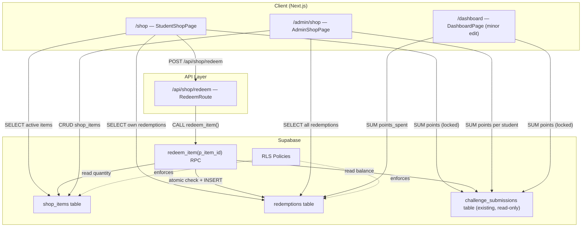

# Design Document: Points Shop

## Overview

The Points Shop is a reward system that lets students spend points earned from graded challenge submissions to redeem teacher-created rewards. The feature is entirely additive — it introduces two new database tables and four new files, with one minor edit to the dashboard. Removing the shop folder and tables leaves the rest of the application completely unaffected.

### Key Design Decisions

- **Computed balance, never stored**: `spendable_balance` is derived on demand from existing `challenge_submissions` and new `redemptions` data. This avoids synchronization bugs and keeps the schema simple.
- **Atomic redemption via RPC**: The balance check, quantity check, and insert happen inside a single Postgres transaction via a Supabase RPC function, preventing race conditions and double-spending.
- **Same repo, same Supabase project**: The shop reads student scores from the existing `challenge_submissions` table. No data migration or cross-service calls are needed.
- **Isolation**: All shop code lives in `app/shop/`, `app/admin/shop/`, and `app/api/shop/`. The only touch to existing code is adding a spendable balance display to `app/dashboard/page.tsx`.

---

## Architecture



### Data Flow: Spendable Balance

```
spendable_balance =
  SUM(challenge_submissions.points WHERE is_locked = true AND user_id = ?)
  - SUM(redemptions.points_spent WHERE user_id = ?)
```

This computation runs client-side after two parallel Supabase queries. It is never stored in the database.

### Data Flow: Redemption

```
Student clicks "Redeem"
  → POST /api/shop/redeem { item_id }
    → Verify auth (401 if missing)
    → Call Supabase RPC redeem_item(p_item_id)
      → BEGIN TRANSACTION
        → Compute spendable_balance for auth.uid()
        → IF balance < item.cost → RAISE EXCEPTION 'insufficient_balance'
        → SELECT quantity, redemption_count for item
        → IF quantity IS NOT NULL AND remaining <= 0 → RAISE EXCEPTION 'out_of_stock'
        → INSERT INTO redemptions (user_id, item_id, points_spent)
      → COMMIT
    → Return { success: true } or { error: message }
  → Client updates local balance state
```

---

## Components and Interfaces

### New Files

| Path | Type | Responsibility |
|------|------|----------------|
| `supabase/add-shop-tables.sql` | SQL migration | Creates `shop_items`, `redemptions`, RLS policies, `redeem_item` RPC |
| `app/shop/page.tsx` | Next.js page | Student shop: balance display, item grid, redemption history |
| `app/admin/shop/page.tsx` | Next.js page | Teacher: create/edit/deactivate items, view all redemptions and balances |
| `app/api/shop/redeem/route.ts` | API route | Validates auth, calls `redeem_item` RPC, returns result |
| `lib/utils/shop.ts` | Utility module | Pure functions: balance computation, validation, sorting |
| `lib/utils/__tests__/shop.test.ts` | Test file | Unit + property-based tests for shop utilities |

### Modified Files

| Path | Change |
|------|--------|
| `app/dashboard/page.tsx` | Add spendable balance display for students (one extra query) |

### Component Breakdown

#### `app/shop/page.tsx` — StudentShopPage

Responsibilities (single-file, client component):
1. Auth guard — redirect to `/login` if unauthenticated
2. Load spendable balance (two parallel queries)
3. Load active shop items
4. Load own redemption history
5. Render `<BalanceDisplay>` (inline component)
6. Render `<ShopItemGrid>` (inline component)
7. Render `<RedemptionHistory>` (inline component)
8. Handle redeem action → POST to `/api/shop/redeem` → update local state

Key state:
```typescript
interface StudentShopState {
  balance: number
  items: ShopItem[]
  redemptions: Redemption[]
  loading: boolean
  redeeming: string | null  // item_id currently being redeemed
  error: string | null
}
```

#### `app/admin/shop/page.tsx` — AdminShopPage

Responsibilities:
1. Auth guard — redirect to `/login` if unauthenticated or not teacher
2. Load all shop items (active + inactive)
3. Load all redemptions with student names and item titles
4. Load all students with their computed spendable balances
5. Render item management form (create / edit)
6. Render item list with deactivate/edit actions
7. Render redemption log table
8. Render student balance table

Key state:
```typescript
interface AdminShopState {
  items: ShopItem[]
  redemptions: RedemptionWithDetails[]
  studentBalances: StudentBalance[]
  form: ShopItemForm
  editingId: string | null
  loading: boolean
  error: string | null
}
```

#### `app/api/shop/redeem/route.ts` — RedeemRoute

```typescript
// POST /api/shop/redeem
// Body: { item_id: string }
// Returns: { success: true } | { error: string }
// Status: 200 | 400 | 401 | 500
```

#### `lib/utils/shop.ts` — Shop Utilities (pure functions)

```typescript
/** Compute spendable balance from raw data */
export function computeSpendableBalance(
  lockedPoints: number[],
  pointsSpent: number[]
): number

/** Check if a student can afford an item */
export function canAfford(balance: number, cost: number): boolean

/** Check if an item is in stock */
export function isInStock(quantity: number | null, redemptionCount: number): boolean

/** Determine if the Redeem button should be disabled */
export function isRedeemDisabled(
  balance: number,
  item: Pick<ShopItem, 'cost' | 'quantity' | 'redemption_count'>
): boolean

/** Validate shop item form data */
export function validateShopItemForm(form: ShopItemForm): ValidationResult

/** Sort redemptions by most recent first */
export function sortRedemptionsByRecent(redemptions: Redemption[]): Redemption[]

/** Build the insert payload for a new shop item */
export function buildShopItemInsert(
  form: ShopItemForm,
  teacherId: string
): ShopItemInsert
```

---

## Data Models

### TypeScript Interfaces

```typescript
// lib/types/shop.ts

export interface ShopItem {
  id: string
  title: string
  description: string | null
  cost: number                  // integer >= 1
  image_url: string | null
  quantity: number | null       // null = unlimited
  is_active: boolean
  created_by: string
  created_at: string
  // Computed client-side for display:
  redemption_count?: number     // how many times redeemed
}

export interface Redemption {
  id: string
  user_id: string
  item_id: string
  points_spent: number
  redeemed_at: string
}

export interface RedemptionWithDetails extends Redemption {
  student_name: string
  item_title: string
}

export interface StudentBalance {
  user_id: string
  student_name: string
  total_earned: number
  total_spent: number
  spendable_balance: number
}

export interface ShopItemForm {
  title: string
  description: string
  cost: string                  // string for form input, parsed to int on submit
  image_url: string
  quantity: string              // empty string = unlimited
}

export interface ValidationResult {
  valid: boolean
  errors: Record<string, string>
}

export interface ShopItemInsert {
  title: string
  description: string | null
  cost: number
  image_url: string | null
  quantity: number | null
  is_active: true
  created_by: string
}
```

### Database Tables

```sql
-- New table 1: Shop items created by teacher
CREATE TABLE shop_items (
  id          UUID PRIMARY KEY DEFAULT gen_random_uuid(),
  title       TEXT NOT NULL,
  description TEXT,
  cost        INTEGER NOT NULL CHECK (cost >= 1),
  image_url   TEXT,
  quantity    INTEGER CHECK (quantity IS NULL OR quantity >= 1),
  is_active   BOOLEAN NOT NULL DEFAULT true,
  created_by  UUID NOT NULL REFERENCES profiles(id) ON DELETE CASCADE,
  created_at  TIMESTAMPTZ NOT NULL DEFAULT now()
);

-- New table 2: Redemption ledger
CREATE TABLE redemptions (
  id           UUID PRIMARY KEY DEFAULT gen_random_uuid(),
  user_id      UUID NOT NULL REFERENCES profiles(id) ON DELETE CASCADE,
  item_id      UUID NOT NULL REFERENCES shop_items(id) ON DELETE CASCADE,
  points_spent INTEGER NOT NULL CHECK (points_spent >= 1),
  redeemed_at  TIMESTAMPTZ NOT NULL DEFAULT now()
);

-- Indexes
CREATE INDEX idx_shop_items_is_active  ON shop_items(is_active);
CREATE INDEX idx_shop_items_created_by ON shop_items(created_by);
CREATE INDEX idx_redemptions_user_id   ON redemptions(user_id);
CREATE INDEX idx_redemptions_item_id   ON redemptions(item_id);
```

### Supabase RPC Function

```sql
CREATE OR REPLACE FUNCTION redeem_item(p_item_id UUID)
RETURNS void
LANGUAGE plpgsql
SECURITY DEFINER
AS $$
DECLARE
  v_cost            INTEGER;
  v_quantity        INTEGER;
  v_redeemed_count  INTEGER;
  v_earned          INTEGER;
  v_spent           INTEGER;
  v_balance         INTEGER;
BEGIN
  -- Lock the item row to prevent concurrent redemptions
  SELECT cost, quantity
    INTO v_cost, v_quantity
    FROM shop_items
   WHERE id = p_item_id AND is_active = true
     FOR UPDATE;

  IF NOT FOUND THEN
    RAISE EXCEPTION 'item_not_found';
  END IF;

  -- Check quantity
  IF v_quantity IS NOT NULL THEN
    SELECT COUNT(*) INTO v_redeemed_count
      FROM redemptions
     WHERE item_id = p_item_id;

    IF v_redeemed_count >= v_quantity THEN
      RAISE EXCEPTION 'out_of_stock';
    END IF;
  END IF;

  -- Compute spendable balance for the calling user
  SELECT COALESCE(SUM(points), 0) INTO v_earned
    FROM challenge_submissions
   WHERE user_id = auth.uid() AND is_locked = true;

  SELECT COALESCE(SUM(points_spent), 0) INTO v_spent
    FROM redemptions
   WHERE user_id = auth.uid();

  v_balance := v_earned - v_spent;

  IF v_balance < v_cost THEN
    RAISE EXCEPTION 'insufficient_balance';
  END IF;

  -- Insert redemption
  INSERT INTO redemptions (user_id, item_id, points_spent)
  VALUES (auth.uid(), p_item_id, v_cost);
END;
$$;
```

**Note**: `challenge_submissions.is_locked` and `challenge_submissions.points` are existing columns used by the grading system. The RPC reads them but never modifies them.

---

## Correctness Properties

*A property is a characteristic or behavior that should hold true across all valid executions of a system — essentially, a formal statement about what the system should do. Properties serve as the bridge between human-readable specifications and machine-verifiable correctness guarantees.*

### Property Reflection

Before writing properties, reviewing the prework for redundancy:

- Properties from 1.1 (balance formula), 3.1 (canAfford), and 3.2 (isInStock) are all distinct: they test different pure functions.
- Properties from 2.3 (button disabled when cost > balance) and 2.4 (button disabled when out of stock) can be combined into a single `isRedeemDisabled` property that covers both conditions.
- Properties from 3.1 and 3.3 are distinct: 3.1 tests the boolean check, 3.3 tests the shape of the insert record.
- Properties from 4.2 (insert payload) and 4.3 (cost validation) are distinct.
- Properties from 2.2 (item card rendering) and 5.1 (redemption row rendering) are distinct rendering properties.
- Properties from 2.5 (sort order) stands alone.

After reflection: 9 distinct properties, no redundancy.

---

### Property 1: Spendable Balance Formula

*For any* list of locked submission point values and any list of redemption point values, `computeSpendableBalance` SHALL return the arithmetic difference of their sums.

**Validates: Requirements 1.1, 1.3**

---

### Property 2: Shop Item Card Renders Required Fields

*For any* active `ShopItem` with arbitrary title, description, cost, and optional image URL, the rendered `ShopItemCard` output SHALL contain the item's title, description, and cost. When `image_url` is non-null, the output SHALL also contain the image.

**Validates: Requirements 2.2**

---

### Property 3: Redeem Button Disabled State

*For any* combination of student spendable balance, item cost, item quantity, and redemption count, `isRedeemDisabled` SHALL return `true` if and only if `cost > balance` OR (`quantity` is not null AND `redemption_count >= quantity`).

**Validates: Requirements 2.3, 2.4**

---

### Property 4: Redemption History Sort Order

*For any* non-empty array of `Redemption` objects with arbitrary `redeemed_at` timestamps, `sortRedemptionsByRecent` SHALL return an array where each element's `redeemed_at` is greater than or equal to the next element's `redeemed_at`.

**Validates: Requirements 2.5**

---

### Property 5: Afford Check Correctness

*For any* non-negative integer balance and any positive integer cost, `canAfford(balance, cost)` SHALL return `true` if and only if `balance >= cost`.

**Validates: Requirements 3.1**

---

### Property 6: In-Stock Check Correctness

*For any* quantity value (null or non-negative integer) and any non-negative redemption count, `isInStock(quantity, redemptionCount)` SHALL return `true` if and only if `quantity` is null OR `redemptionCount < quantity`.

**Validates: Requirements 3.2**

---

### Property 7: Redemption Record Shape

*For any* valid `(userId, itemId, cost)` triple, `buildRedemptionRecord` SHALL return an object with `user_id === userId`, `item_id === itemId`, and `points_spent === cost`.

**Validates: Requirements 3.3**

---

### Property 8: Shop Item Insert Always Sets is_active and created_by

*For any* valid `ShopItemForm` and any teacher user ID, `buildShopItemInsert` SHALL return an object where `is_active === true` and `created_by === teacherId`.

**Validates: Requirements 4.2**

---

### Property 9: Cost Validation Rejects Values Less Than 1

*For any* integer less than 1 (including 0 and all negative integers), `validateShopItemForm` with that cost value SHALL return a `ValidationResult` with `valid === false` and a non-empty error for the `cost` field.

**Validates: Requirements 4.3**

---

## Error Handling

### Client-Side Errors

| Scenario | Handling |
|----------|----------|
| Unauthenticated access to `/shop` | Redirect to `/login` via `router.push('/login')` |
| Unauthenticated access to `/admin/shop` | Redirect to `/login` |
| Non-teacher access to `/admin/shop` | Redirect to `/login` |
| Supabase query failure on page load | Show inline error message; do not crash |
| Redeem API returns 400 (insufficient balance) | Show toast/inline error: "Not enough points" |
| Redeem API returns 400 (out of stock) | Show toast/inline error: "This item is out of stock" |
| Redeem API returns 500 | Show toast/inline error: "Something went wrong, please try again" |
| Form validation failure (cost < 1) | Show inline field error before submitting |

### API Route Errors (`/api/shop/redeem`)

| Scenario | HTTP Status | Response Body |
|----------|-------------|---------------|
| No session / unauthenticated | 401 | `{ error: "Unauthorized" }` |
| Missing or invalid `item_id` in body | 400 | `{ error: "item_id is required" }` |
| RPC raises `insufficient_balance` | 400 | `{ error: "Insufficient balance" }` |
| RPC raises `out_of_stock` | 400 | `{ error: "Item is out of stock" }` |
| RPC raises `item_not_found` | 400 | `{ error: "Item not found or inactive" }` |
| Unexpected Supabase error | 500 | `{ error: "Internal server error" }` |

### Database-Level Constraints

The `shop_items` table has `CHECK (cost >= 1)` and `CHECK (quantity IS NULL OR quantity >= 1)`. The `redemptions` table has `CHECK (points_spent >= 1)`. These act as a final safety net even if application-level validation is bypassed.

---

## Testing Strategy

### Unit Tests (example-based)

Located in `lib/utils/__tests__/shop.test.ts`.

Focus areas:
- Auth guard behavior (redirect on unauthenticated/unauthorized access)
- Form validation with specific valid and invalid inputs
- Edge cases: balance exactly equal to cost (should be enabled), quantity exactly 1 with 1 redemption (should be disabled)
- API route: 401 on missing session, 400 on RPC error codes

### Property-Based Tests

This feature uses [fast-check](https://github.com/dubzzz/fast-check) for property-based testing, which is already a common choice in the TypeScript/Next.js ecosystem.

Each property test runs a minimum of **100 iterations**.

Tag format: `// Feature: shop, Property N: <property text>`

**Property 1 — Spendable Balance Formula**
```typescript
// Feature: shop, Property 1: computeSpendableBalance returns sum(earned) - sum(spent)
fc.assert(fc.property(
  fc.array(fc.integer({ min: 0, max: 1000 })),
  fc.array(fc.integer({ min: 1, max: 500 })),
  (earned, spent) => {
    const result = computeSpendableBalance(earned, spent)
    const expected = earned.reduce((a, b) => a + b, 0) - spent.reduce((a, b) => a + b, 0)
    return result === expected
  }
), { numRuns: 100 })
```

**Property 2 — Shop Item Card Renders Required Fields**
```typescript
// Feature: shop, Property 2: ShopItemCard renders title, description, and cost for any item
fc.assert(fc.property(
  fc.record({
    id: fc.uuid(),
    title: fc.string({ minLength: 1 }),
    description: fc.option(fc.string()),
    cost: fc.integer({ min: 1, max: 10000 }),
    image_url: fc.option(fc.webUrl()),
    quantity: fc.option(fc.integer({ min: 1 })),
    is_active: fc.constant(true),
    created_by: fc.uuid(),
    created_at: fc.date().map(d => d.toISOString()),
  }),
  (item) => {
    const rendered = renderShopItemCard(item)
    return rendered.includes(item.title) &&
           rendered.includes(String(item.cost)) &&
           (item.description == null || rendered.includes(item.description))
  }
), { numRuns: 100 })
```

**Property 3 — Redeem Button Disabled State**
```typescript
// Feature: shop, Property 3: isRedeemDisabled iff cost > balance OR out of stock
fc.assert(fc.property(
  fc.integer({ min: 0, max: 10000 }),
  fc.integer({ min: 1, max: 10000 }),
  fc.option(fc.integer({ min: 1, max: 100 })),
  fc.integer({ min: 0, max: 200 }),
  (balance, cost, quantity, redemptionCount) => {
    const disabled = isRedeemDisabled(balance, { cost, quantity, redemption_count: redemptionCount })
    const shouldBeDisabled =
      cost > balance ||
      (quantity !== null && redemptionCount >= quantity)
    return disabled === shouldBeDisabled
  }
), { numRuns: 100 })
```

**Property 4 — Redemption History Sort Order**
```typescript
// Feature: shop, Property 4: sortRedemptionsByRecent returns descending order
fc.assert(fc.property(
  fc.array(fc.record({
    id: fc.uuid(),
    user_id: fc.uuid(),
    item_id: fc.uuid(),
    points_spent: fc.integer({ min: 1 }),
    redeemed_at: fc.date().map(d => d.toISOString()),
  }), { minLength: 1 }),
  (redemptions) => {
    const sorted = sortRedemptionsByRecent(redemptions)
    for (let i = 0; i < sorted.length - 1; i++) {
      if (sorted[i].redeemed_at < sorted[i + 1].redeemed_at) return false
    }
    return true
  }
), { numRuns: 100 })
```

**Property 5 — Afford Check Correctness**
```typescript
// Feature: shop, Property 5: canAfford(balance, cost) iff balance >= cost
fc.assert(fc.property(
  fc.integer({ min: 0, max: 10000 }),
  fc.integer({ min: 1, max: 10000 }),
  (balance, cost) => canAfford(balance, cost) === (balance >= cost)
), { numRuns: 100 })
```

**Property 6 — In-Stock Check Correctness**
```typescript
// Feature: shop, Property 6: isInStock iff quantity is null OR redemptionCount < quantity
fc.assert(fc.property(
  fc.option(fc.integer({ min: 1, max: 100 })),
  fc.integer({ min: 0, max: 200 }),
  (quantity, redemptionCount) => {
    const result = isInStock(quantity, redemptionCount)
    const expected = quantity === null || redemptionCount < quantity
    return result === expected
  }
), { numRuns: 100 })
```

**Property 7 — Redemption Record Shape**
```typescript
// Feature: shop, Property 7: buildRedemptionRecord preserves userId, itemId, cost
fc.assert(fc.property(
  fc.uuid(),
  fc.uuid(),
  fc.integer({ min: 1, max: 10000 }),
  (userId, itemId, cost) => {
    const record = buildRedemptionRecord(userId, itemId, cost)
    return record.user_id === userId &&
           record.item_id === itemId &&
           record.points_spent === cost
  }
), { numRuns: 100 })
```

**Property 8 — Shop Item Insert Sets is_active and created_by**
```typescript
// Feature: shop, Property 8: buildShopItemInsert always sets is_active=true and correct created_by
fc.assert(fc.property(
  fc.record({
    title: fc.string({ minLength: 1 }),
    description: fc.string(),
    cost: fc.string().map(() => String(fc.integer({ min: 1, max: 9999 }))),
    image_url: fc.string(),
    quantity: fc.string(),
  }),
  fc.uuid(),
  (form, teacherId) => {
    // Only test with valid cost to isolate this property
    const validForm = { ...form, cost: '10' }
    const insert = buildShopItemInsert(validForm, teacherId)
    return insert.is_active === true && insert.created_by === teacherId
  }
), { numRuns: 100 })
```

**Property 9 — Cost Validation Rejects Values Less Than 1**
```typescript
// Feature: shop, Property 9: validateShopItemForm rejects cost < 1
fc.assert(fc.property(
  fc.integer({ max: 0 }),  // 0 and all negatives
  (invalidCost) => {
    const form: ShopItemForm = {
      title: 'Test',
      description: '',
      cost: String(invalidCost),
      image_url: '',
      quantity: '',
    }
    const result = validateShopItemForm(form)
    return result.valid === false && result.errors.cost !== undefined
  }
), { numRuns: 100 })
```

### Integration Tests

These verify RLS policies and the RPC function against a real (local) Supabase instance:

1. **Teacher can CRUD shop_items** — teacher-authenticated client can insert, select, update, delete
2. **Student can only SELECT active shop_items** — student client cannot insert/update/delete; cannot see inactive items
3. **Student can insert own redemptions** — student client can insert a redemption with their own user_id
4. **Student cannot insert redemptions for other users** — RLS rejects inserts where user_id ≠ auth.uid()
5. **Teacher can SELECT all redemptions** — teacher client sees redemptions from all students
6. **RPC rejects insufficient balance** — calling `redeem_item` when balance < cost raises error
7. **RPC rejects out-of-stock items** — calling `redeem_item` when quantity exhausted raises error
8. **RPC is atomic** — concurrent calls with balance exactly equal to cost result in exactly one success
