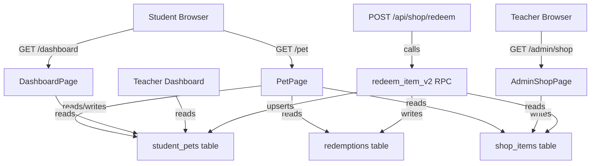

# Design Document: Virtual Pet

## Overview

The Virtual Pet feature adds a gamified companion system to Henry Math Classroom. Every student gets an egg that hatches and evolves through five stages as they feed it using food items purchased from the existing shop. The feature is purely additive: it extends `shop_items` with two new columns and introduces one new table (`student_pets`). All existing shop, redemption, and scoring logic is preserved without modification.

### Key Design Decisions

- **Additive-only schema**: No existing tables are structurally altered beyond two nullable/defaulted columns on `shop_items`. Removing the new columns and table leaves the app fully functional.
- **Inline SVG illustrations**: All pet artwork is rendered as inline SVG code — no external image files, no emoji. This keeps the bundle self-contained and allows CSS animations to target SVG elements directly.
- **Atomic feeding via extended RPC**: The existing `redeem_item()` Postgres function is extended (or a new `redeem_item_v2()` is introduced) to handle pet XP updates in the same transaction as the redemption insert, preventing partial state.
- **Derived inventory**: A student's accessory inventory is derived from their `redemptions` rows filtered by `category = 'accessory'` — no separate inventory table is needed.
- **XP threshold logic as a pure function**: `computeEvolutionStage(xp)` is a pure TypeScript function, making it trivially testable and reusable across client and server.

---

## Architecture



### Data Flow: Feeding

1. Student clicks "Redeem" on a food item in `/shop`.
2. `POST /api/shop/redeem` is called with `item_id`.
3. The route calls `redeem_item_v2(p_item_id)` — a Postgres function that:
   - Locks the `shop_items` row.
   - Checks quantity and balance (existing logic).
   - Inserts into `redemptions`.
   - If `category = 'food'`, upserts `student_pets` with `xp += food_xp` and recomputes `evolution_stage`.
4. The API returns `{ success: true, xp_gained?: number, new_stage?: string }`.
5. The client updates the pet preview card and, if on `/pet`, triggers the Happy_Animation.

### Data Flow: Species Change (Pet_Item)

1. Student redeems a Pet_Item.
2. `redeem_item_v2` detects `category = 'pet'`, reads `target_species` from `shop_items`.
3. Updates `student_pets`: sets `species`, resets `xp = 0`, `evolution_stage = 'baby'`, `equipped_accessories = []`.

---

## Components and Interfaces

### New Files

| Path | Purpose |
|------|---------|
| `app/pet/page.tsx` | Pet page — student-only route |
| `components/pet/PetSvg.tsx` | Renders the correct SVG for a given species + stage |
| `components/pet/EggSvg.tsx` | Shared egg SVG illustration |
| `components/pet/BackgroundScene.tsx` | Stage-specific background (inline SVG/CSS) |
| `components/pet/XpBar.tsx` | XP progress bar |
| `components/pet/AccessoryInventory.tsx` | Equip/unequip accessory list |
| `components/pet/PetPreviewCard.tsx` | Compact dashboard widget |
| `components/pet/SpeciesSelector.tsx` | One-time species selection UI |
| `components/pet/EvolutionSparkle.tsx` | CSS particle burst animation |
| `lib/types/pet.ts` | TypeScript interfaces for pet domain |
| `lib/utils/pet.ts` | Pure utility functions (XP thresholds, stage computation) |
| `lib/utils/__tests__/pet.test.ts` | Unit + property tests for pet utilities |

### Modified Files

| Path | Change |
|------|--------|
| `app/api/shop/redeem/route.ts` | Call `redeem_item_v2` instead of `redeem_item`; return `xp_gained` and `new_stage` |
| `app/admin/shop/page.tsx` | Add `category` selector and conditional `food_xp` / `target_species` fields |
| `app/shop/page.tsx` | Display category badge on each item card |
| `app/dashboard/page.tsx` | Add `PetPreviewCard` for student users |
| `lib/types/shop.ts` | Add `category`, `food_xp`, `target_species` fields to `ShopItem` and `ShopItemForm` |
| `lib/utils/shop.ts` | Extend `validateShopItemForm` and `buildShopItemInsert` for new fields |
| `supabase/add-shop-tables.sql` | (New migration file) Add columns + `student_pets` table + `redeem_item_v2` |

### Key Component Interfaces

```typescript
// PetSvg props
interface PetSvgProps {
  species: Species           // 'dragon' | 'fox' | 'cat'
  stage: EvolutionStage      // 'egg' | 'baby' | 'teen' | 'adult' | 'legendary'
  animation?: PetAnimation   // 'idle' | 'happy' | 'none'
  size?: number              // CSS pixels, default 200
  className?: string
}

// XpBar props
interface XpBarProps {
  xp: number
  stage: EvolutionStage
}

// AccessoryInventory props
interface AccessoryInventoryProps {
  ownedAccessories: AccessoryItem[]
  equippedIds: string[]
  onEquip: (id: string) => void
  onUnequip: (id: string) => void
}

// PetPreviewCard props
interface PetPreviewCardProps {
  pet: StudentPet | null   // null = no pet row yet
}
```

---

## Data Models

### Database Schema Extensions

```sql
-- Migration: add-virtual-pet.sql

-- 1. Extend shop_items (additive only)
ALTER TABLE shop_items
  ADD COLUMN IF NOT EXISTS category TEXT
    NOT NULL DEFAULT 'other'
    CHECK (category IN ('food', 'accessory', 'pet', 'other')),
  ADD COLUMN IF NOT EXISTS food_xp INTEGER
    CHECK (food_xp IS NULL OR food_xp >= 1),
  ADD COLUMN IF NOT EXISTS target_species TEXT
    CHECK (target_species IS NULL OR target_species IN ('dragon', 'fox', 'cat'));

-- 2. New student_pets table
CREATE TABLE IF NOT EXISTS student_pets (
  id                   UUID PRIMARY KEY DEFAULT gen_random_uuid(),
  user_id              UUID NOT NULL UNIQUE REFERENCES profiles(id) ON DELETE CASCADE,
  species              TEXT CHECK (species IS NULL OR species IN ('dragon', 'fox', 'cat')),
  xp                   INTEGER NOT NULL DEFAULT 0 CHECK (xp >= 0),
  evolution_stage      TEXT NOT NULL DEFAULT 'egg'
                         CHECK (evolution_stage IN ('egg', 'baby', 'teen', 'adult', 'legendary')),
  equipped_accessories UUID[] NOT NULL DEFAULT '{}',
  created_at           TIMESTAMPTZ NOT NULL DEFAULT now(),
  updated_at           TIMESTAMPTZ NOT NULL DEFAULT now()
);

-- Indexes
CREATE INDEX IF NOT EXISTS idx_student_pets_user_id ON student_pets(user_id);

-- RLS
ALTER TABLE student_pets ENABLE ROW LEVEL SECURITY;

CREATE POLICY "student_pets_student_own" ON student_pets
  FOR ALL
  USING (user_id = auth.uid())
  WITH CHECK (user_id = auth.uid());

CREATE POLICY "student_pets_teacher_select" ON student_pets
  FOR SELECT
  USING (
    EXISTS (
      SELECT 1 FROM user_roles ur
      JOIN roles r ON ur.role_id = r.id
      WHERE ur.user_id = auth.uid()
        AND r.name IN ('teacher', 'administrator')
        AND ur.class_id IS NULL
    )
  );
```

### TypeScript Types (`lib/types/pet.ts`)

```typescript
export type Species = 'dragon' | 'fox' | 'cat'
export type EvolutionStage = 'egg' | 'baby' | 'teen' | 'adult' | 'legendary'
export type PetAnimation = 'idle' | 'happy' | 'none'

export interface StudentPet {
  id: string
  user_id: string
  species: Species | null          // null while in egg stage
  xp: number
  evolution_stage: EvolutionStage
  equipped_accessories: string[]   // array of shop_item UUIDs
  created_at: string
  updated_at: string
}

export interface AccessoryItem {
  id: string
  title: string
  image_url: string | null
}

// Extended ShopItem fields (added to lib/types/shop.ts)
// category: 'food' | 'accessory' | 'pet' | 'other'
// food_xp: number | null
// target_species: Species | null
```

### XP Thresholds

```typescript
// lib/utils/pet.ts
export const XP_THRESHOLDS: Record<EvolutionStage, number> = {
  egg:       0,    // transitions to baby on species selection
  baby:      0,    // starts at 0 XP after hatching
  teen:      100,
  adult:     300,
  legendary: 700,
}

// Pure function: given XP, return the correct stage
// (assumes species has already been selected, i.e., past egg stage)
export function computeEvolutionStage(xp: number): EvolutionStage {
  if (xp >= 700) return 'legendary'
  if (xp >= 300) return 'adult'
  if (xp >= 100) return 'teen'
  return 'baby'
}

// XP needed to reach the next stage (null if legendary)
export function xpToNextStage(xp: number, stage: EvolutionStage): number | null {
  const thresholds: Record<string, number | null> = {
    egg:       null,
    baby:      100,
    teen:      300,
    adult:     700,
    legendary: null,
  }
  return thresholds[stage]
}
```

### Extended `redeem_item_v2` RPC

```sql
CREATE OR REPLACE FUNCTION redeem_item_v2(p_item_id UUID)
RETURNS jsonb
LANGUAGE plpgsql
SECURITY DEFINER
AS $$
DECLARE
  v_cost            INTEGER;
  v_quantity        INTEGER;
  v_category        TEXT;
  v_food_xp         INTEGER;
  v_target_species  TEXT;
  v_redeemed_count  INTEGER;
  v_earned          INTEGER;
  v_spent           INTEGER;
  v_balance         INTEGER;
  v_current_xp      INTEGER;
  v_new_xp          INTEGER;
  v_new_stage       TEXT;
  v_result          jsonb;
BEGIN
  -- Lock item row
  SELECT cost, quantity, category, food_xp, target_species
    INTO v_cost, v_quantity, v_category, v_food_xp, v_target_species
    FROM shop_items
   WHERE id = p_item_id AND is_active = true
     FOR UPDATE;

  IF NOT FOUND THEN
    RAISE EXCEPTION 'item_not_found';
  END IF;

  -- Quantity check
  IF v_quantity IS NOT NULL THEN
    SELECT COUNT(*) INTO v_redeemed_count FROM redemptions WHERE item_id = p_item_id;
    IF v_redeemed_count >= v_quantity THEN
      RAISE EXCEPTION 'out_of_stock';
    END IF;
  END IF;

  -- Balance check
  SELECT COALESCE(SUM(points), 0) INTO v_earned
    FROM challenge_submissions WHERE user_id = auth.uid() AND points IS NOT NULL;
  SELECT COALESCE(SUM(points_spent), 0) INTO v_spent
    FROM redemptions WHERE user_id = auth.uid();
  v_balance := v_earned - v_spent;

  IF v_balance < v_cost THEN
    RAISE EXCEPTION 'insufficient_balance';
  END IF;

  -- Insert redemption
  INSERT INTO redemptions (user_id, item_id, points_spent)
  VALUES (auth.uid(), p_item_id, v_cost);

  v_result := jsonb_build_object('success', true);

  -- Pet feeding logic
  IF v_category = 'food' AND v_food_xp IS NOT NULL THEN
    -- Upsert student_pets row
    INSERT INTO student_pets (user_id, xp, evolution_stage)
    VALUES (auth.uid(), 0, 'egg')
    ON CONFLICT (user_id) DO NOTHING;

    -- Add XP and recompute stage
    UPDATE student_pets
       SET xp = xp + v_food_xp,
           evolution_stage = CASE
             WHEN species IS NULL THEN evolution_stage  -- still egg, no stage change
             WHEN (xp + v_food_xp) >= 700 THEN 'legendary'
             WHEN (xp + v_food_xp) >= 300 THEN 'adult'
             WHEN (xp + v_food_xp) >= 100 THEN 'teen'
             ELSE 'baby'
           END,
           updated_at = now()
     WHERE user_id = auth.uid()
     RETURNING xp, evolution_stage INTO v_new_xp, v_new_stage;

    v_result := jsonb_build_object(
      'success', true,
      'xp_gained', v_food_xp,
      'new_xp', v_new_xp,
      'new_stage', v_new_stage
    );

  ELSIF v_category = 'pet' AND v_target_species IS NOT NULL THEN
    -- Species change: reset pet
    INSERT INTO student_pets (user_id, species, xp, evolution_stage, equipped_accessories)
    VALUES (auth.uid(), v_target_species, 0, 'baby', '{}')
    ON CONFLICT (user_id) DO UPDATE
      SET species = v_target_species,
          xp = 0,
          evolution_stage = 'baby',
          equipped_accessories = '{}',
          updated_at = now();

    v_result := jsonb_build_object(
      'success', true,
      'species_changed', true,
      'new_species', v_target_species
    );
  END IF;

  RETURN v_result;
END;
$$;
```

---

## Correctness Properties

*A property is a characteristic or behavior that should hold true across all valid executions of a system — essentially, a formal statement about what the system should do. Properties serve as the bridge between human-readable specifications and machine-verifiable correctness guarantees.*

### Property 1: XP threshold monotonicity

*For any* non-negative integer XP value, `computeEvolutionStage(xp)` returns the unique stage whose threshold is the highest threshold not exceeding `xp`. Specifically: `xp < 100` → `'baby'`, `100 ≤ xp < 300` → `'teen'`, `300 ≤ xp < 700` → `'adult'`, `xp ≥ 700` → `'legendary'`. The function is total and never returns `'egg'`.

**Validates: Requirements 3.1, 3.2, 3.4**

---

### Property 2: Feeding increases XP by exactly food_xp

*For any* student pet with current XP `x` and any food item with `food_xp = n`, after a successful feeding the pet's XP equals `x + n`.

**Validates: Requirements 5.1, 5.3**

---

### Property 3: Feeding stage consistency

*For any* student pet with current XP `x` and any food item with `food_xp = n`, after a successful feeding the pet's `evolution_stage` equals `computeEvolutionStage(x + n)` (provided the pet has a non-null species).

**Validates: Requirements 5.3, 3.2**

---

### Property 4: Pet item reset

*For any* current pet state (any species, any XP ≥ 0, any equipped accessories) and any target species `s`, after redeeming a Pet_Item with `target_species = s`, the pet row has `species = s`, `xp = 0`, `evolution_stage = 'baby'`, and `equipped_accessories = []`.

**Validates: Requirements 12.1, 12.4**

---

### Property 5: Species selection locks the prompt

*For any* `StudentPet` record with a non-null `species`, the `PetPage` render function should not include the species selection prompt in its output.

**Validates: Requirements 2.5**

---

### Property 6: Equip adds to equipped_accessories

*For any* `equipped_accessories` array and any accessory ID not already in that array, calling `equipAccessory(id, equippedIds)` returns an array that contains `id` and has length `equippedIds.length + 1`.

**Validates: Requirements 6.3, 6.5**

---

### Property 7: Unequip removes from equipped_accessories

*For any* `equipped_accessories` array and any accessory ID in that array, calling `unequipAccessory(id, equippedIds)` returns an array that does not contain `id` and has length `equippedIds.length - 1`.

**Validates: Requirements 6.4**

---

### Property 8: Equip/unequip round trip

*For any* `equipped_accessories` array and any accessory ID not in that array, equipping then unequipping that ID returns an array equal to the original.

**Validates: Requirements 6.3, 6.4**

---

### Property 9: Food item form validation requires food_xp

*For any* shop item form with `category = 'food'` and an empty, null, or zero `food_xp` value, `validateShopItemForm` returns `{ valid: false }` with a `food_xp` error.

**Validates: Requirements 4.3**

---

### Property 10: Non-food item form sets food_xp to null

*For any* shop item form with `category` in `['accessory', 'pet', 'other']`, `buildShopItemInsert` returns a payload with `food_xp = null`.

**Validates: Requirements 4.4**

---

### Property 11: Pet initialization defaults

*For any* student user ID with no existing `student_pets` row, calling the pet initialization function creates a row with `evolution_stage = 'egg'`, `xp = 0`, `species = null`, and `equipped_accessories = []`.

**Validates: Requirements 2.1**

---

### Property 12: XP bar displays correct next threshold

*For any* pet with XP `x` and stage `s` (where `s ≠ 'legendary'`), the XP bar render function returns a `nextThreshold` value equal to `XP_THRESHOLDS[nextStage(s)]` and a `currentXp` value equal to `x`.

**Validates: Requirements 3.6**

---

## Error Handling

### Redemption Errors

The `redeem_item_v2` RPC raises named exceptions that the API route maps to HTTP responses:

| Exception | HTTP Status | User Message |
|-----------|-------------|--------------|
| `item_not_found` | 400 | "Item not found or inactive" |
| `out_of_stock` | 400 | "Item is out of stock" |
| `insufficient_balance` | 400 | "Not enough points" |
| Unexpected | 500 | "Internal server error" |

### Pet Page Errors

- **Failed to load pet data**: Display an error card with a retry button; do not show a broken pet.
- **Failed to equip/unequip accessory**: Revert the optimistic UI update and display an inline error message (Requirement 6.6).
- **Failed to select species**: Display an inline error; keep the species selection prompt visible.
- **No pet row on first visit**: Silently create the row; if creation fails, display a friendly error and a retry button.

### Admin Shop Form Errors

- `category = 'food'` with missing `food_xp`: Inline validation error, form not submitted (Requirement 4.3).
- `category = 'pet'` with missing `target_species`: Inline validation error, form not submitted.

---

## Testing Strategy

### Unit Tests (example-based)

Focus on specific behaviors and edge cases:

- `computeEvolutionStage`: boundary values (0, 99, 100, 299, 300, 699, 700, 10000)
- `xpToNextStage`: all stages including legendary (returns null)
- `validateShopItemForm` with new fields: food category without food_xp, pet category without target_species, valid food item
- `buildShopItemInsert` with new fields: non-food category produces null food_xp
- `PetSvg`: renders without crashing for all 12 species+stage combinations
- `EggSvg`: renders without crashing
- `XpBar`: correct display for legendary stage (no next threshold)
- `PetPreviewCard`: renders egg placeholder when pet is null
- `AccessoryInventory`: renders empty-state message when no accessories owned
- Authentication redirect: unauthenticated user at `/pet` is redirected to `/login`
- Authorization redirect: teacher user at `/pet` is redirected to `/dashboard`

### Property-Based Tests

Use [fast-check](https://github.com/dubzzz/fast-check) (already compatible with the TypeScript/Jest setup). Each property test runs a minimum of 100 iterations.

```typescript
// lib/utils/__tests__/pet.test.ts

// Feature: virtual-pet, Property 1: XP threshold monotonicity
fc.assert(fc.property(fc.nat(10000), (xp) => {
  const stage = computeEvolutionStage(xp)
  if (xp >= 700) return stage === 'legendary'
  if (xp >= 300) return stage === 'adult'
  if (xp >= 100) return stage === 'teen'
  return stage === 'baby'
}), { numRuns: 1000 })

// Feature: virtual-pet, Property 2 & 3: Feeding increases XP and updates stage
fc.assert(fc.property(
  fc.nat(1000),          // current xp
  fc.integer({ min: 1, max: 500 }),  // food_xp
  (currentXp, foodXp) => {
    const newXp = currentXp + foodXp
    const newStage = computeEvolutionStage(newXp)
    return newXp === currentXp + foodXp && newStage === computeEvolutionStage(newXp)
  }
), { numRuns: 500 })

// Feature: virtual-pet, Property 6: Equip adds to array
fc.assert(fc.property(
  fc.array(fc.uuid(), { maxLength: 10 }),
  fc.uuid(),
  (equippedIds, newId) => {
    fc.pre(!equippedIds.includes(newId))
    const result = equipAccessory(newId, equippedIds)
    return result.includes(newId) && result.length === equippedIds.length + 1
  }
), { numRuns: 200 })

// Feature: virtual-pet, Property 7: Unequip removes from array
fc.assert(fc.property(
  fc.array(fc.uuid(), { minLength: 1, maxLength: 10 }),
  (equippedIds) => {
    const idToRemove = equippedIds[0]
    const result = unequipAccessory(idToRemove, equippedIds)
    return !result.includes(idToRemove) && result.length === equippedIds.length - 1
  }
), { numRuns: 200 })

// Feature: virtual-pet, Property 8: Equip/unequip round trip
fc.assert(fc.property(
  fc.array(fc.uuid(), { maxLength: 10 }),
  fc.uuid(),
  (equippedIds, newId) => {
    fc.pre(!equippedIds.includes(newId))
    const afterEquip = equipAccessory(newId, equippedIds)
    const afterUnequip = unequipAccessory(newId, afterEquip)
    return afterUnequip.length === equippedIds.length &&
           equippedIds.every(id => afterUnequip.includes(id))
  }
), { numRuns: 200 })

// Feature: virtual-pet, Property 9: Food form validation requires food_xp
fc.assert(fc.property(
  fc.record({
    title: fc.string({ minLength: 1, maxLength: 100 }),
    description: fc.string({ maxLength: 500 }),
    cost: fc.integer({ min: 1, max: 10000 }).map(String),
    image_url: fc.constant(''),
    quantity: fc.constant(''),
    category: fc.constant('food'),
    food_xp: fc.oneof(fc.constant(''), fc.constant('0'), fc.constant('-1')),
    target_species: fc.constant(''),
  }),
  (form) => {
    const result = validateShopItemForm(form)
    return result.valid === false && 'food_xp' in result.errors
  }
), { numRuns: 200 })

// Feature: virtual-pet, Property 10: Non-food category produces null food_xp
fc.assert(fc.property(
  fc.record({
    title: fc.string({ minLength: 1, maxLength: 100 }),
    description: fc.constant(''),
    cost: fc.integer({ min: 1, max: 10000 }).map(String),
    image_url: fc.constant(''),
    quantity: fc.constant(''),
    category: fc.oneof(
      fc.constant('accessory'),
      fc.constant('pet'),
      fc.constant('other')
    ),
    food_xp: fc.constant(''),
    target_species: fc.constant(''),
  }),
  fc.uuid(),
  (form, teacherId) => {
    const payload = buildShopItemInsert(form, teacherId)
    return payload.food_xp === null
  }
), { numRuns: 200 })
```

### Integration Tests

- RLS: student can read/update their own `student_pets` row; cannot read another student's row.
- RLS: teacher can read all `student_pets` rows.
- `redeem_item_v2`: food item redemption increases pet XP atomically.
- `redeem_item_v2`: pet item redemption resets pet state atomically.
- Accessory inventory: redeemed accessory appears in student's inventory on `/pet`.

### SVG Rendering Smoke Tests

- All 12 species+stage SVG combinations render without throwing.
- Egg SVG renders without throwing.
- All 5 background scenes render without throwing.
